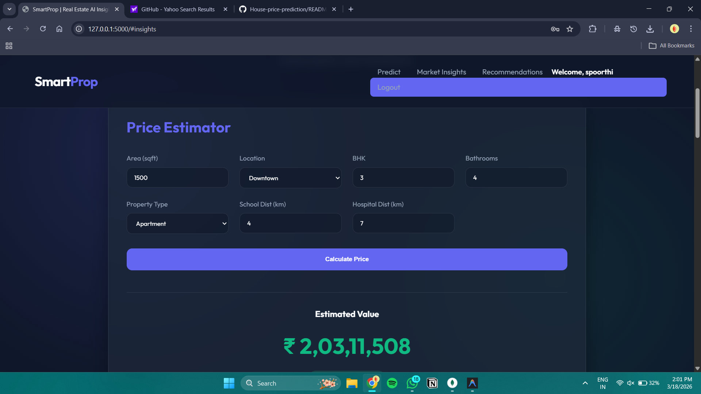
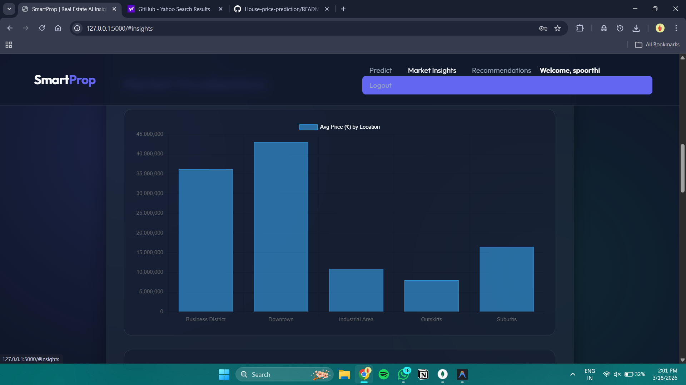
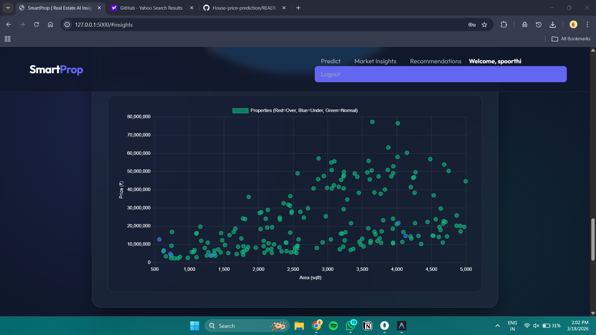
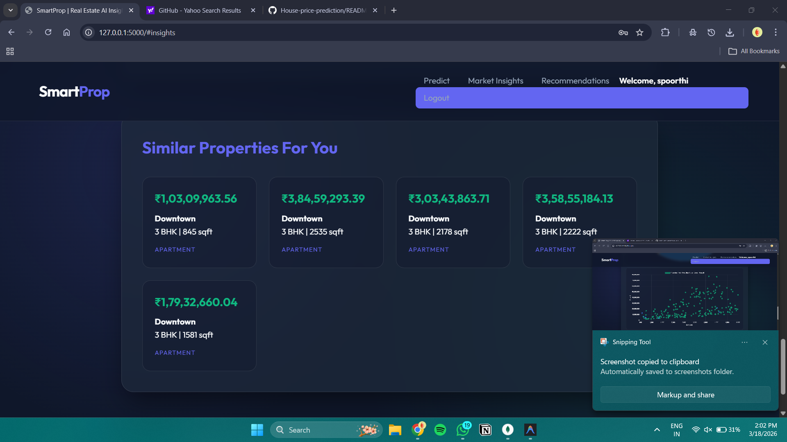

🏠 Smart Real Estate Price Prediction & Recommendation System

# 🏠 Smart Real Estate Price Prediction & Recommendation System

## 📌 Description
📌 Description

The Smart Real Estate Price Prediction System is a full-stack web application built using Python and Flask.
It leverages machine learning models to accurately predict house prices, recommend similar properties, detect anomalies in pricing, and provide market insights for better decision-making.

🚀 Features

💰 Price Prediction: Predict house prices based on location, area, BHK, and other features using XGBoost

🤖 Recommendations: Suggest similar properties using K-Nearest Neighbors (KNN)

⚠️ Anomaly Detection: Identify overpriced and underpriced properties using Isolation Forest

📊 Market Insights: Visualize housing trends and data patterns

🔐 Authentication System: Secure Login & Signup functionality

🛠️ Admin Dashboard: Manage users and property data

🛠️ Technologies Used

Backend: Python, Flask

Machine Learning: Scikit-learn, XGBoost, Pandas, NumPy

Database: MongoDB

Frontend: HTML, CSS, JavaScript

Visualization: Chart.js

## 🧠 System Architecture

1. User inputs property details via web interface  
2. Flask backend processes input  
3. Data preprocessing applied  
4. XGBoost predicts price  
5. KNN recommends properties  
6. Isolation Forest detects anomalies  
7. Results displayed  

---

## 📌 Workflow Diagram

User → Flask Backend → ML Models → Output

## 📁 Dataset

- Source: Synthetic / Kaggle dataset  
- Features used:
  - Location  
  - Area (sqft)  
  - Number of bedrooms (BHK)  
  - Price  
  - Property type

## 📊 Model Performance

- Model: XGBoost Regressor  
- R² Score: ~0.96  
- High prediction accuracy on test data  
- Efficient feature-based learning

  ## 📈 Key Insights

- Location and area are the most influential features  
- Larger properties show non-linear price trends  
- Model performs well on mid-range housing data  
  
## 📸 Project Screenshots

### 🏠 Home Page  
Landing page providing navigation to all major modules of the system.  

---

### 🔐 Login Page  
Secure authentication page for existing users.  

---

### 📝 Signup Page  
User registration page for creating new accounts.  

---

### 🛠️ Admin Dashboard  
Central control panel for managing users and data.  

---

### 💰 Price Estimator  
Core module where users input property details to get predicted prices.  

---

### 📊 Market Insights  
Displays charts and trends for better understanding of housing data.  

---

### 🤖 Recommendation System  
Provides similar property suggestions based on user input.  

📁 Project Structure
project/
├── data/               
├── models/             
├── static/             
├── templates/          
├── screenshots/        # Store all images here
├── app.py              
├── train_model.py      
├── generate_data.py    
└── README.md           
💻 How to Run

Install Python

Install dependencies

pip install flask pandas numpy scikit-learn xgboost joblib pymongo

Run the application

python app.py

Open in browser

http://127.0.0.1:5000/
📊 Model Performance

XGBoost model achieves high accuracy on housing datasets

Efficient handling of feature-based predictions

Reliable recommendation and anomaly detection system

🔮 Future Improvements

🌐 Deploy on AWS / Render

📱 Mobile responsive UI

🔗 Real-time property API integration

🧠 Explainable AI (feature importance visualization)

📄 Export reports (PDF/Excel)

👨‍💻 Author

Soumya Reddy
B.Tech Computer Science Engineering
